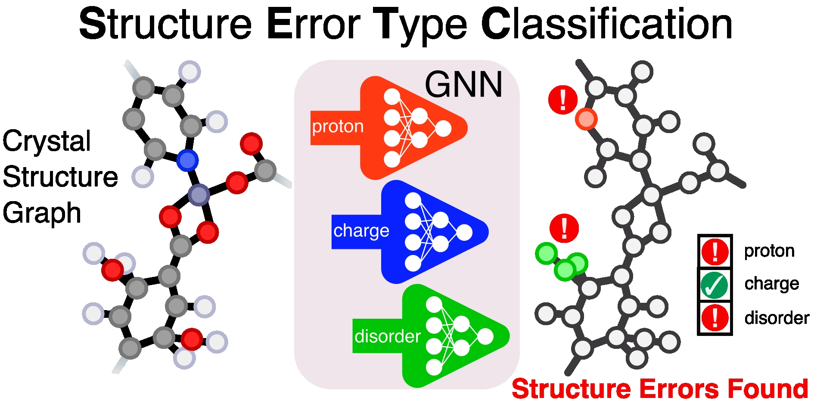

# Structure Error Type Classification (SETC)

[](https://doi.org/10.1039/d5sc05477j)
[](https://doi.org/10.5281/zenodo.15058403)

[](https://black.readthedocs.io/en/stable/)

<p align="center">
    
</p>

This repository provides utilities to predict crystal structures error types (i.e. relating to protons, charge, disorder) in periodic crystal structures, primarily metal-organic frameworks (MOF), defined in the cif file format. Other chemical categories—e.g., molecules, metal complex, etc.—in this format may also be studied.

Pretrained Graph Attention (GAT) models trained on a manually inspected set of experimental MOFs are provided using various node featurization approaches. Comprehensive details regarding this methodology may be found in the publication at the attached doi.

## Prerequisites
All necessary packages are listed in the [requirements.txt](requirements.txt) except for the [CSD python API](https://www.ccdc.cam.ac.uk/solutions/software/csd-python/) which must be installed separately according to their [installation instructions](https://downloads.ccdc.cam.ac.uk/documentation/API/installation_notes.html). This package is only necessary if utilizing the MOSAEC node features (metal oxidation state & ligand formal charges). 

All testing was performed using Python version 3.9.X 

### Example Installation

1. Create a separate environment with a compatible python version
```
conda create --name setc_gat python=3.9 
```
2. (***If planning to use MOSAEC features***) Install `csd-python-api` according to [installation instructions](https://downloads.ccdc.cam.ac.uk/documentation/API/installation_notes.html). For example, using conda on linux systems:
```
conda install --channel=https://conda.ccdc.cam.ac.uk csd-python-api
```
3. Install the remaining dependencies either from the requirements file, or individually.
```
pip install -r requirements.txt
```
**OR**
```
pip install pymatgen==2024.7.18 torch==2.4.1 torch-geometric==2.6.0 mendeleev==0.17.0
```


## Usage
1. Ensure that input crystal structures are formatted as **CIF** files and the symmetry is converted to **P1**.
2. Download the pretrained SETC files `models.zip` from [zenodo](https://zenodo.org/uploads/15058403) & extract in the SETC-GAT directory.
3. Run any (or a combination) of the following commands on a CIF file OR directory containing CIF files based on your desired error type label output. Change the --node_features argument to allow for calculation of different node features (i.e. `atomic`, `localenv`, `mosaec`) & combinations (i.e. chemist).

**Multi-Label Error Type Classification**
```
python classify_errors.py /path/to/CIF --node_features atomic mosaec --multi
```

**Binary Relevance Error Type Classification**
```
python classify_errors.py /path/to/CIF --node_features atomic mosaec --binary
```

Error (Presence/Absence) Classification
```
python classify_errors.py /path/to/CIF --node_features atomic mosaec --error
```

### Models

> [!IMPORTANT]  
> While use of the "chemist" model is recommended for most applications (followed by the related "atomic-mosaec" models), these choices require access to the CSD Python API. Users without access to a valid CSD activation key are recommended to utilize the "atomic" models instead.

### Optional Arguments

User may invoke the `--store_graphs` option to save the structure graph files in the `.pt` format. This will speed up the consecutive use of error classification models.

## Licensing
The [GPL-3.0 license](https://www.gnu.org/licenses/gpl-3.0.en.html) applies to the utilization of the SETC models. Follow the license guidelines regarding the use, sharing, adaptation, and attribution of this data.

## Citation
Complete details relating to the appropriate citation are not currently available, and will be updated in the future. Please contact the authors listed in the Contact section before referring to this work in any publication.

## Contact
Reach out to any of the following authors with any questions:

Marco Gibaldi: marco.gibaldi@uottawa.ca

Tom Woo: tom.woo@uottawa.ca
